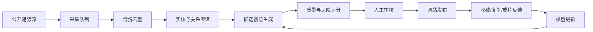

# 灵感自进化系统开发计划

## 1. 目标

建立一个每天自动吸收新热点、维护内容图谱、产生候选创意，并根据人工审核和用户行为持续调整排序的内容系统。

“自进化”不等于自动复制和自动发布，而是：

1. 自动发现变化；
2. 自动结构化和去重；
3. 自动生成候选组合；
4. 人工决定是否发布；
5. 使用真实表现调整下一轮选择。

北极星指标：每周由平台方案产生并成功发布的有效视频数。

## 2. 系统闭环

## 3. 分阶段开发

### 并行轨道：公开信息暂存（从 Phase 0 开始）

系统能力建设期间同步积累公开热点，避免等数据库完成后才开始形成内容样本。暂存数据与正式内容库严格分离：

- 定时任务每天 07:30、13:30、19:30 采集最近 24 小时公开热点；
- 结果按运行批次写入 `data/collection-inbox/`，一轮一个不可覆盖的 JSON 文件；
- 每条记录保存规范名称、别名、分类、来源 URL、来源标题、发现时间、来源可见指标、生命周期、适用语境、可视化动作、风险等级和采集备注；
- 无法从公开页面确认的热度或增速写为 `null`，禁止推测或编造；
- 暂存记录属于待验证外部输入，不直接进入网站、知识库或发布流程；
- 开发任务逐步补齐 Schema、去重、来源验证、实体归一化和入库迁移器；只有校验通过的记录才能进入正式数据层；
- 只访问公开且允许访问的来源，不绕过登录、验证码、付费墙或访问限制，不收集个人敏感信息，不下载未经授权的图片、台词和视频片段。

阶段验收：连续运行可产生可追溯、可校验、无覆盖的采集批次；任意指标都能定位到公开来源和采集时间；后续入库能够保留原始证据。

### 阶段 A：内容地基（第 1—2 周）

- 建立角色、作品、场景、热梗、叙事结构、风格六类数据表。
- 完成别名归一化、标签体系、版权状态和来源证据字段。
- 导入首批种子库：100 个角色原型、100 个场景结构、50 个热梗结构。
- 建立运营后台的候选、审核、驳回三个队列。

验收：任何一条内容都能回答“来自哪里、属于什么、能否商用、最后何时验证”。

### 阶段 B：每日流水线（第 3—4 周）

- 将暂存采集任务升级为正式来源适配器，按 07:30、13:30、19:30 拉取已配置公开源。
- 聚合相同事件，记录多来源证据和热度变化。
- 识别人物、作品、梗、动作、道具和情绪。
- 生成 20—50 条候选创意，但不自动发布。
- 10:00 前将高分候选送入人工审核台。

验收：运营者每天在 30 分钟内完成选题，不再手工浏览所有平台。

### 阶段 C：创意引擎（第 5—6 周）

- 建立兼容矩阵：角色能力、场景约束、生成难度、冲突类型。
- 使用“关系合理性 + 反差 + 可视化”约束组合，不做纯随机拼接。
- 自动生成开场钩子、30 秒节奏、镜头清单、提示词和发布文案。
- 增加近似度检测，避免连续发布换皮创意。

验收：人工通过率达到 25%，重复内容率低于 10%。

### 阶段 D：反馈学习（第 7—8 周）

- 采集曝光、展开、收藏、复制、导出、成片确认等事件。
- 为不同创作者建立偏好画像，不直接混用全站偏好。
- 每周更新排序权重；权重变化可回滚、可解释。
- 设置探索流量，避免系统只推荐历史热门题材。

验收：四周内提示词复制率和成片率持续提升，无单一题材垄断首页。

### 阶段 E：商业化（第 9—12 周）

- 免费浏览与会员制作包。
- 专题包、原创角色库、团队协作。
- 授权内容专区和品牌定制。
- 热点雷达、系列追踪和 API 导出。

## 4. 技术建议

- 项目记忆：统一存放在 `memory/`；`memory/PROGRESS.md` 是当前状态、任务队列、决策和迭代记录的唯一真源。
- 前端：现有 Vite 项目，后续迁移 React/Next.js 均可。
- API：Node.js + TypeScript。
- 主数据库：PostgreSQL。
- 相似搜索：首版 PostgreSQL `pgvector`，规模扩大后再评估独立向量库。
- 定时任务：首版系统 Cron；生产环境采用带重试和可观测性的任务队列。
- 文件：对象存储只保存经过授权的缩略图和生成资产。
- 分析：事件表 + 每日聚合表，避免直接用生产表跑大查询。

## 5. 必须记录的产品事件

| 事件 | 用途 |
|---|---|
| `idea_impression` | 判断曝光基数 |
| `idea_opened` | 判断标题与封面吸引力 |
| `idea_saved` | 判断长期价值 |
| `prompt_copied` | 判断方案是否可执行 |
| `idea_exported` | 判断专业使用意图 |
| `video_created` | 核心成片转化 |
| `video_published` | 北极星指标输入 |
| `idea_hidden` | 识别反感和重复 |
| `risk_reported` | 修正合规策略 |

## 6. 发布门槛

候选必须同时满足：总分不低于 70、风险不高于中等、至少一个可靠来源、相似度低于阈值、人工审核通过。涉及具体知名角色、真人肖像和影视片段的候选，不进入官方可商用模板。
